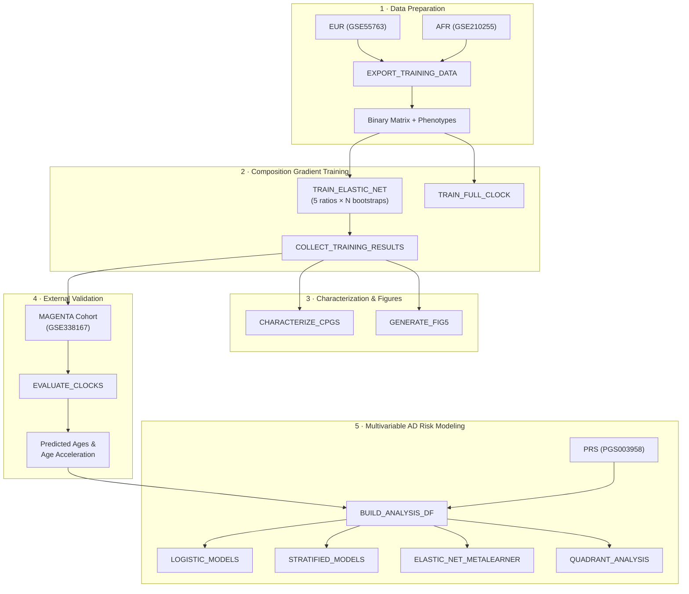

# Ancestry-Aware Epigenetic Clock Pipeline

[](https://www.nextflow.io/)
[](https://www.docker.com/)
[](https://apptainer.org/)
[](LICENSE)

> **End-to-end reproducible pipeline for building, characterizing, and evaluating ancestry-balanced DNA methylation clocks and multivariable Alzheimer's Disease risk models.**

This pipeline accompanies the manuscript:

> *Training DNA Methylation Clocks on Individuals from Multiple Ancestries Increases Generalizability.* (In preparation)

It fully automates the analysis from raw GEO-deposited methylation data through trained elastic net clocks, CpG characterization, independent cohort validation, and multivariable AD risk modeling — producing all manuscript figures, tables, and statistical outputs.

---

## Table of Contents

- [Why Do We Need a Nextflow Pipeline?](#why-do-we-need-a-nextflow-pipeline)
- [Pipeline Overview](#pipeline-overview)
- [Quick Start](#quick-start)
- [Full Production Run](#full-production-run)
- [Data Sources](#data-sources)
- [Pipeline Parameters](#pipeline-parameters)
- [Output Structure](#output-structure)
- [Container Architecture](#container-architecture)
- [HPC / SLURM Execution](#hpc--slurm-execution)
- [Repository Structure](#repository-structure)
- [Citation](#citation)
- [License](#license)

---

## Why Do We Need a Nextflow Pipeline?

Many bioinformatics studies are notoriously difficult to reproduce: there are dozens of specific software versions to keep track of, incompatibilities between them and with your specific compute, datasets live in very disparate repositories and are processed differently, and there are a myriad of sequential analytical steps to run. With this pipeline I wanted to address that by:

- **Full containerization** — Every process runs inside versioned Docker/Singularity containers with pinned dependencies.
- **Scatter-gather parallelism** — Bootstrap training across 5 ancestry composition ratios scales from a laptop to a SLURM cluster with zero code changes.
- **One command, full manuscript** — A single `nextflow run` call downloads data, trains models, generates figures, and produces all statistical outputs reported in the paper.
- **Test suite included** — Synthetic test data lets you verify the entire pipeline executes correctly before committing real compute.

---

## Pipeline Overview



| Stage | Processes | What It Does |
|-------|-----------|--------------|
| **1. Data Preparation** | `EXPORT_TRAINING_DATA` | Merges EUR and AFR methylation datasets, exports optimized binary matrices |
| **2. Clock Training** | `TRAIN_ELASTIC_NET`, `TRAIN_FULL_CLOCK`, `COLLECT_TRAINING_RESULTS` | Parallel elastic net regression across 5 ancestry ratios (100:0 → 0:100) with N bootstrap iterations |
| **3. Characterization** | `CHARACTERIZE_CPGS`, `GENERATE_FIG5` | CpG stability analysis, delta-beta, meQTL overlap, genomic annotation, and Figure 5 |
| **4. Validation** | `EVALUATE_CLOCKS` | Predicts epigenetic age on independent MAGENTA cohort; computes age acceleration residuals |
| **5. AD Integration** | `BUILD_ANALYSIS_DF`, `LOGISTIC_MODELS`, `STRATIFIED_MODELS`, `ELASTIC_NET_METALEARNER`, `QUADRANT_ANALYSIS` | Multivariable logistic regression, ancestry-stratified models, meta-learning, and 4-quadrant concordance |

---

## Quick Start

### Prerequisites

| Tool | Version | Notes |
|------|---------|-------|
| [Nextflow](https://www.nextflow.io/) | ≥ 22.10.0 | `curl -s https://get.nextflow.io \| bash` |
| [Docker](https://www.docker.com/) **or** [Singularity](https://apptainer.org/) | ≥ 20.10 / ≥ 3.8 | Container runtime |
| Java | ≥ 11 | Required by Nextflow |

### 1. Clone the Repository

```bash
git clone https://github.com/seba2550/ancestry-aware-clock-pipeline.git
cd ancestry-aware-clock-pipeline
```

### 2. Run the Test Suite

Verify installation using built-in synthetic data (no downloads needed):

```bash
# Without containers (local execution)
nextflow run main.nf -profile test

# With Docker containers
nextflow run main.nf -profile test,docker

# With Singularity/Apptainer
nextflow run main.nf -profile test,singularity
```

Or via the Makefile:

```bash
make test
```

The test profile runs 2 bootstrap iterations on tiny synthetic matrices (~50 CpGs × 20 samples) and completes in under 5 minutes.

---

## Full Production Run

### With Docker

```bash
nextflow run main.nf \
  -profile docker \
  --eur_beta /path/to/GSE55763_beta.rds \
  --eur_meta /path/to/GSE55763_meta.rds \
  --afr_beta /path/to/GSE210255_beta.rds \
  --afr_meta /path/to/GSE210255_meta.rds \
  --magenta_beta /path/to/GSE338167_beta.rds \
  --magenta_meta /path/to/GSE338167_meta.rds \
  --outdir ./results
```

### Customize Bootstrap Iterations

```bash
nextflow run main.nf -profile docker \
  --n_bootstrap 250 \
  ...
```

### Resume After Failure

Nextflow caches completed tasks. Resume from where you left off:

```bash
nextflow run main.nf -profile docker -resume ...
```

---

## Data Sources

All input datasets are publicly available:

| Dataset | GEO Accession | Description | Population |
|---------|---------------|-------------|------------|
| EUR training | [GSE55763](https://www.ncbi.nlm.nih.gov/geo/query/acc.cgi?acc=GSE55763) | Illumina 450K blood methylation | European (n = 507) |
| AFR training | [GSE210255](https://www.ncbi.nlm.nih.gov/geo/query/acc.cgi?acc=GSE210255) | Illumina 450K blood methylation | African American (n = 1,380) |
| MAGENTA validation | [GSE338167](https://www.ncbi.nlm.nih.gov/geo/query/acc.cgi?acc=GSE338167) | MAGENTA cohort methylation | Multi-ethnic |
| PRS weights | [PGS003958](https://www.pgscatalog.org/score/PGS003958/) | AD Polygenic Risk Score | — |

---

## Pipeline Parameters

Key parameters with defaults (full reference in [`docs/parameters.md`](docs/parameters.md)):

| Parameter | Default | Description |
|-----------|---------|-------------|
| `--n_bootstrap` | `50` | Number of bootstrap iterations per ancestry ratio |
| `--alpha` | `0.5` | Elastic net mixing parameter (0 = ridge, 1 = lasso) |
| `--fixed_lambda` | `0.01047...` | Regularization strength (pre-optimized via CV) |
| `--age_min` | `19.0` | Minimum age filter for training samples |
| `--age_max` | `78.0` | Maximum age filter for training samples |
| `--outdir` | `./results` | Output directory |

Override any parameter on the command line:
```bash
nextflow run main.nf --n_bootstrap 500 --alpha 0.3 -profile docker
```

---

## Output Structure

```
results/
├── data_prep/                          # Merged binary matrices & phenotypes
│   └── clock_combined_full*
├── models/                             # Trained clock coefficients
│   ├── composition_v2_coefs.csv        # All bootstrap coefficients (5 ratios × N iters)
│   ├── Composition_summary.csv         # Aggregated training metrics
│   ├── full_clock_coef.csv             # Pooled-ancestry clock coefficients
│   └── full_clock_summary.csv          # Pooled clock performance
├── characterization/                   # CpG feature analysis
│   ├── cpg_characterization_*          # Genomic region, island, delta-beta tables
│   └── core_genes_custom.csv           # Core gene list across ratios
├── figures/                            # Publication-ready figures
│   ├── Figure5.pdf
│   └── Figure5.png
├── evaluation/                         # MAGENTA validation results
│   ├── magenta_all_predicted_ages_and_acceleration.csv
│   └── composition_evaluation_summary.csv
└── aim3_models/                        # Multivariable AD risk model outputs
    ├── primary_logistic_models.csv
    ├── stratified_logistic_models.csv
    ├── metalearner_feature_weights.csv
    └── quadrant_concordance_stats.csv
```

Full output documentation: [`docs/output.md`](docs/output.md)

---

## Container Architecture

Three purpose-built containers isolate dependencies:

| Container | Base Image | Key Dependencies | Purpose |
|-----------|-----------|-------------------|---------|
| `clock-training` | `python:3.11-slim` | numpy, pandas, scikit-learn, glmnet | Elastic net model training |
| `r-bioconductor` | `bioconductor/bioconductor_docker:3.19` | minfi, glmnet, tidyverse, ggplot2, pROC | Data prep, characterization, evaluation, figures |
| `prs-tools` | `ubuntu:22.04` | PLINK 1.9/2.0, R, tidyverse | Polygenic risk score computation |

Containers are defined in [`containers/`](containers/) with Dockerfiles, validation scripts, and build instructions.

```bash
# Build all containers
docker build -t seba2550/clock-training:1.0.0 containers/clock-training/
docker build -t seba2550/r-bioconductor:1.0.0 containers/r-bioconductor/
docker build -t seba2550/prs-tools:1.0.0 containers/prs-tools/
```

---

## HPC / SLURM Execution

The pipeline includes a SLURM profile for HPC clusters:

```bash
nextflow run main.nf \
  -profile slurm,singularity \
  --n_bootstrap 250 \
  --outdir /scratch/$USER/clock_results
```

Resource configuration is in [`conf/slurm.config`](conf/slurm.config). See [`docs/usage.md`](docs/usage.md) for detailed HPC instructions.

---

## Repository Structure

```
ancestry-aware-clock-pipeline/
├── main.nf                    # Pipeline entry point (DSL2 workflow)
├── nextflow.config            # Global config: profiles, containers, manifest
├── params.yml                 # Default parameter values
├── Makefile                   # Convenience targets (test, clean)
│
├── bin/                       # Executable CLI scripts (Python + R)
│   ├── train_elastic_net.py   #   Elastic net training (single iteration)
│   ├── train_full_clock.py    #   Full pooled-ancestry clock training
│   ├── export_training_data.R #   Data merge & binary export
│   ├── evaluate_clocks.R      #   MAGENTA validation
│   ├── characterize_cpgs.R    #   CpG feature annotation
│   ├── generate_fig5.R        #   Figure 5 composite panel
│   ├── build_analysis_df.R    #   Aim 3 analysis dataframe
│   ├── logistic_models.R      #   Primary logistic regression
│   ├── stratified_models.R    #   Ancestry-stratified models
│   ├── elastic_net_metalearner.R  # Meta-learner stacking
│   └── quadrant_analysis.R    #   4-quadrant concordance
│
├── modules/                   # Nextflow DSL2 process definitions
│   ├── data_prep/             #   EXPORT_TRAINING_DATA
│   ├── clock_training/        #   TRAIN_ELASTIC_NET, TRAIN_FULL_CLOCK, COLLECT_RESULTS
│   ├── characterization/      #   CHARACTERIZE_CPGS, GENERATE_FIG5
│   ├── evaluation/            #   EVALUATE_CLOCKS
│   └── integration/           #   BUILD_ANALYSIS_DF, LOGISTIC_MODELS, etc.
│
├── conf/                      # Execution profiles & resource configs
│   ├── params.config          #   Default parameters
│   ├── base.config            #   Base resource limits
│   ├── test.config            #   Test profile overrides
│   └── slurm.config           #   HPC SLURM profile
│
├── containers/                # Docker container definitions
│   ├── clock-training/        #   Python ML environment
│   ├── r-bioconductor/        #   R/Bioconductor environment
│   └── prs-tools/             #   PLINK + R environment
│
├── assets/                    # Static reference files
│   ├── meqtl_lists/           #   meQTL annotation lists (COSMO, GENOA, EPIGEN)
│   └── prs_weights/           #   PGS003958 AD PRS weights
│
├── tests/                     # Test suite
│   ├── generate_test_data.py  #   Synthetic test data generator
│   └── test_data/             #   Pre-generated synthetic matrices
│
├── docs/                      # Documentation
│   ├── usage.md               #   Execution guide (local, Docker, HPC)
│   ├── output.md              #   Output file reference
│   └── parameters.md          #   Parameter reference
│
├── CITATION.cff               # Machine-readable citation metadata
├── CONTRIBUTING.md             # Contribution guidelines
└── LICENSE                    # MIT License
```

---

## License

This project is licensed under the [MIT License](LICENSE).

---

## Authors

- **Sebastián Cruz-González** — [Capra Lab](https://capralab.org), University of California, San Francisco
